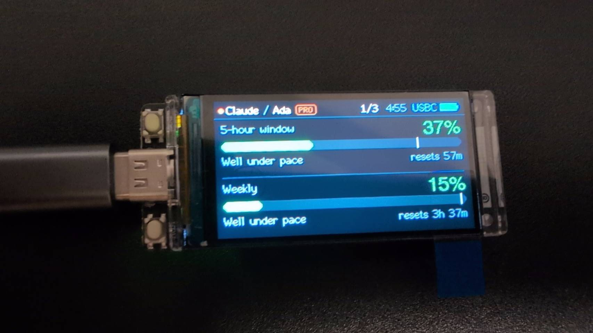
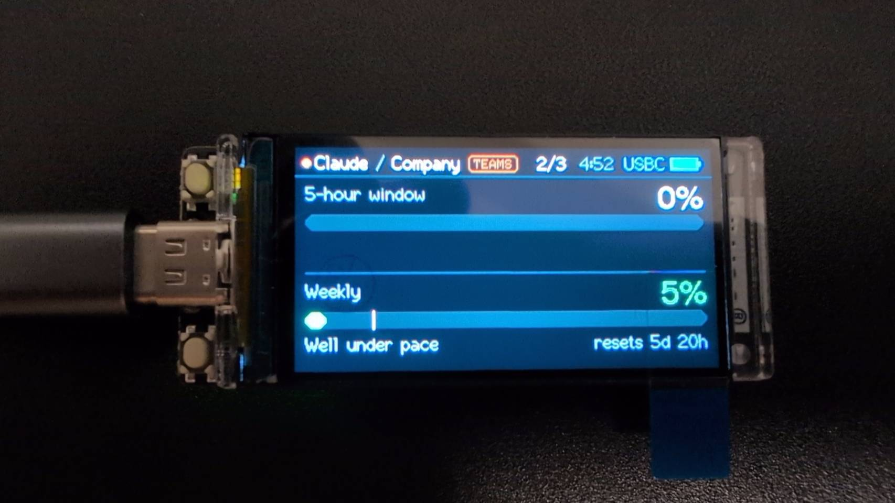
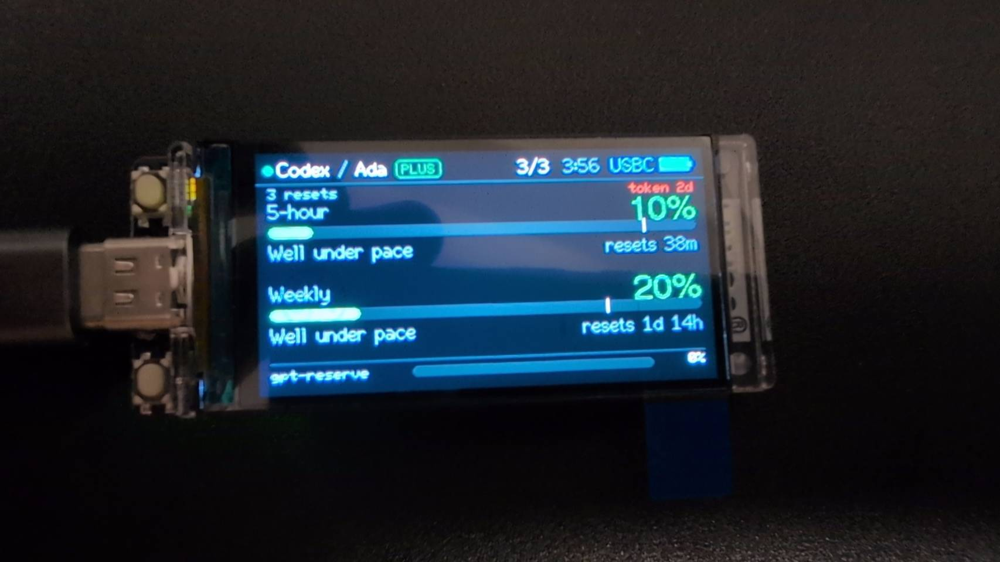

# TokenUsage

English | [正體中文](README.zh-TW.md)

A LilyGo T-Display S3 that shows how much of your AI subscriptions you have
burned through, for as many accounts as you own, and fetches everything
itself over WiFi. No companion app, no bridge, no CLI running somewhere.

One button walks the accounts; whichever one is on screen is the only one
that ever touches the network.

<table>
<tr>
<td></td>
<td></td>
<td></td>
</tr>
<tr>
<td align="center">Claude · personal (Pro)</td>
<td align="center">Claude · Teams</td>
<td align="center">Codex · Plus</td>
</tr>
</table>

## What it does

- **Connects itself.** Up to 8 WiFi networks, tried in list order (priority,
  not signal strength). Loses the link, reconnects in the background instead
  of rebooting.
- **Any mix of accounts, up to 12.** Two personal Claude logins, a Claude
  enterprise org and three Codex accounts is a perfectly ordinary list.
  Nothing pairs vendors up or assumes how many of each you have.
- **Only the visible account fetches.** Accounts you are not looking at run
  no timers and send no requests.
- **Each vendor draws its own screen.** A provider module owns its fetch, its
  layout and its settings form; the shell only supplies the header and a
  rectangle.

## Buttons

| Press | Action |
|---|---|
| KEY once | Next account |
| KEY twice | Stats / Info |
| KEY three or more times | Skip that many accounts |
| KEY hold 10 s | Reboot countdown (hold BOOT 2 s during it to factory reset) |
| BOOT once | Rotate 90 degrees |
| BOOT hold 2 s | Screen off |
| BOOT + KEY 5 s | Deep sleep |
| Any button while asleep | Wake, and that press does nothing else |

A KEY press is held for 280 ms to see whether more are coming, which is what
lets one button carry both actions.

## When it fetches

Two gates stand between a button press and a request:

1. **Stay put for 5 seconds.** Every switch restarts the timer, so pressing
   through half the list costs nothing at all.
2. **Only if the cache is over 3 minutes old.** Flipping back to an account
   you just looked at reuses what is already there.

Outside a switch, the account on screen refreshes every 5 minutes (settable
from 1 to 60 in the admin page).

## Setup

1. First boot opens an open access point called `TokenUsage`. Join it from a
   phone; the captive portal scans and offers nearby networks to pick from
   (still lets you type a hidden one by hand) and asks for **WiFi only** -
   nothing else, because the credentials that come later are
   thousand-character strings.
2. Once online the screen shows `http://tokenusage.local`. Open that from a
   computer (default login `admin` / `admin`, change it under Settings).
3. Add accounts. Paste a credential **once per login**, then press Discover to
   list every organization or workspace it can reach and tick the ones you
   want: each becomes its own row sharing that credential.

Stored credentials are shown masked (`sk-ant-...a3f9`) and never rendered in
full. Leaving a credential field blank keeps the stored one.

### Claude

Copy the `sessionKey` cookie from claude.ai in your browser dev tools. A row
is one `(sessionKey, orgId)` pair, so a personal plan and a Teams plan under
one login are two rows sharing one key, while a second login is simply its
own key.

### Codex / ChatGPT

Copy `tokens.access_token` from `~/.codex/auth.json`. The account id and the
expiry come out of the token itself. That token lasts about 10 days and the
screen warns you when it is nearly out.

Automatic renewal exists but is **off by default**: refresh tokens rotate, so
a device that renews one can sign the Codex CLI on your computer out of that
account.

## Build

```bash
pio run                  # compile
pio run -t upload        # flash
pio device monitor -b 115200
```

## Layout

```
src/
  core/      provider contract, account storage, the carousel and its gates
  providers/ one directory per vendor: fetch + layout + settings form
  ui/        panel, sprite, widgets, and the screens the shell owns
  net/       WiFi list, HTTPS, NTP
  web/       captive portal and admin page
  hal/       board pins and battery
```

Adding a vendor means a new directory under `src/providers` and one line in
`src/core/registry.cpp`. No core file changes.

## Notes

- Both usage endpoints are private APIs. They can change without warning, so
  every field is read defensively: a missing one degrades the screen instead
  of breaking the fetch.
- TLS certificates are not validated (`setInsecure()`), the same trade-off the
  upstream project made. The credentials on the device are the real secret,
  and the device should be treated as physically trusted.

## Credit

Structure, board handling and the pace thresholds follow
[ClaudeStatsPortable](https://github.com/alberthorta/ClaudeStatsPortable) by
Albert Horta (MIT). This project is a ground-up rewrite around a pluggable
provider layer and multi-account switching.
